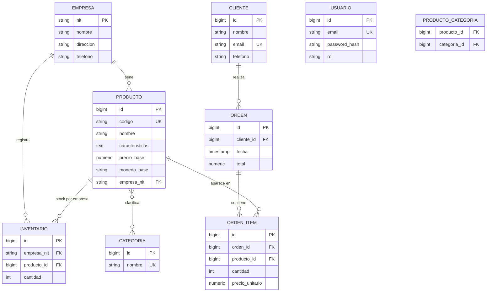

# Modelo Entidad-Relación

Cumple el requisito (f): Empresa, Productos, Categorías, Clientes y Órdenes, con las reglas:
- Un Producto puede pertenecer a **múltiples Categorías** (N–M).
- Un Cliente puede tener **múltiples Órdenes** (1–N).
- Las Órdenes pueden tener **múltiples Productos** (N–M, vía `orden_item`).

El DDL completo está en `backend/src/main/resources/db/migration/V1__schema.sql` (aplicado por Flyway).
